# 📌 Caso I: Payment Assistant - Diseño de Software
## 🧑‍🎓 Estudiante: Franco Vinicio Rojas Lagos

---

## 1. Investigue como realizar un goal map en referencia a técnicas como google sprint o design thinking

## 🔹 Cómo Crear un Goal Map  
📌 **Payment Assistant:**  

1️⃣ **Definir el Objetivo Principal**  
   👉 Automatizar la gestión de pagos recurrentes mediante voz e integración con bancos.  

2️⃣ **Identificar las Entidades Claves**  
   - **Usuario:** Realiza pagos y confirma transacciones.  
   - **Asistente de Voz (IA):** Interpreta comandos y registra pagos.  
   - **Sistema de Notificaciones:** Envía recordatorios de pagos.  
   - **Banco / API de Pagos:** Procesa las transacciones.  
   - **Historial de Pagos:** Guarda y muestra el estado de cada pago.  

3️⃣ **Mapear el Flujo de Información**  
   - 🗣 Usuario da un **comando de voz** → IA interpreta y registra el pago.  
   - 📅 Se programa una **notificación** → Usuario confirma o cancela.  
   - 💳 Si el usuario confirma → **API Bancaria ejecuta el pago**.  
   - 📜 **Historial de pagos** se actualiza con el estado de la transacción.  

4️⃣ **Diagramar el Goal Map**  
   - Usar **herramientas como Miro, Lucidchart o Figma**.  
   - Posicionar el objetivo **a la derecha** y las entidades a la izquierda.  
   - Conectar los elementos con flechas para mostrar relaciones.  

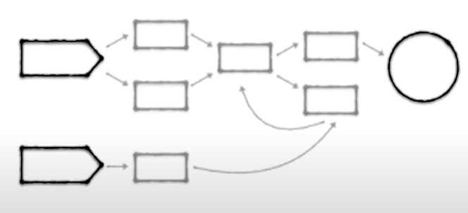

[Design Sprint Tutorial: How To Draw The Map (Day 1)](https://youtu.be/yYNpOKq3Wfg?si=3CsuiJ4yE5RJx5Dz)

---

## 2. Proceda a crear un goal diagram ubicando el objetivo principal del sistema lo más a la derecha del diagrama y las entidades involucradas a la izquierda. Rellene el workflow del mapa y diagramelo en alguna herramienta que se lo permita.

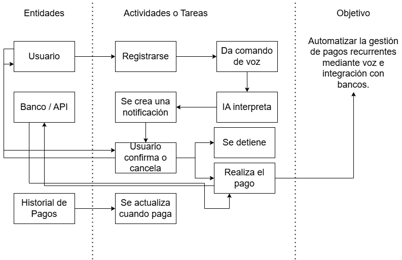

---

## 3. Determine entonces usando ese mapa cuales son los estados que garantizan el éxito del sistema, aquellos puntos que son más valiosos para lograr el objetivo principal del sistema, los cuales van a hacer que el usuario acepte o no el uso de esta aplicación.

## 🔹 1️⃣ Registro del Usuario  
- Un usuario debe **poder registrarse fácilmente**.  

## 🔹 2️⃣ Precisión en la Interpretación de Comandos de Voz (IA)  
- La IA debe **interpretar correctamente los comandos de voz** del usuario.  

## 🔹 3️⃣ Notificaciones y Recordatorios en Tiempo Real  
- El sistema debe **enviar recordatorios oportunos y relevantes** antes de la fecha de pago.  

## 🔹 4️⃣ Confirmación del Pago 
- El usuario debe **sentirse en control de sus transacciones**, confirmando antes de ejecutar el pago.  

## 🔹 5️⃣ Ejecución Segura del Pago
- La transacción debe **realizarse de forma rápida y sin errores** al conectarse con APIs bancarias.

## 🔹 6️⃣ Registro y Accesibilidad al Historial de Pagos  
- El usuario debe **poder consultar sus pagos previos de manera sencilla**.

## 4. Una vez determinados los más importantes, listelos y proceda a diseñar las pantallas de su sistema que realizarían dichos flujos del mapa.

## 5. Diseñe los wireframes en blanco y negro de las pantallas necesarias para esos flujos prioridad #1 para el negocio.

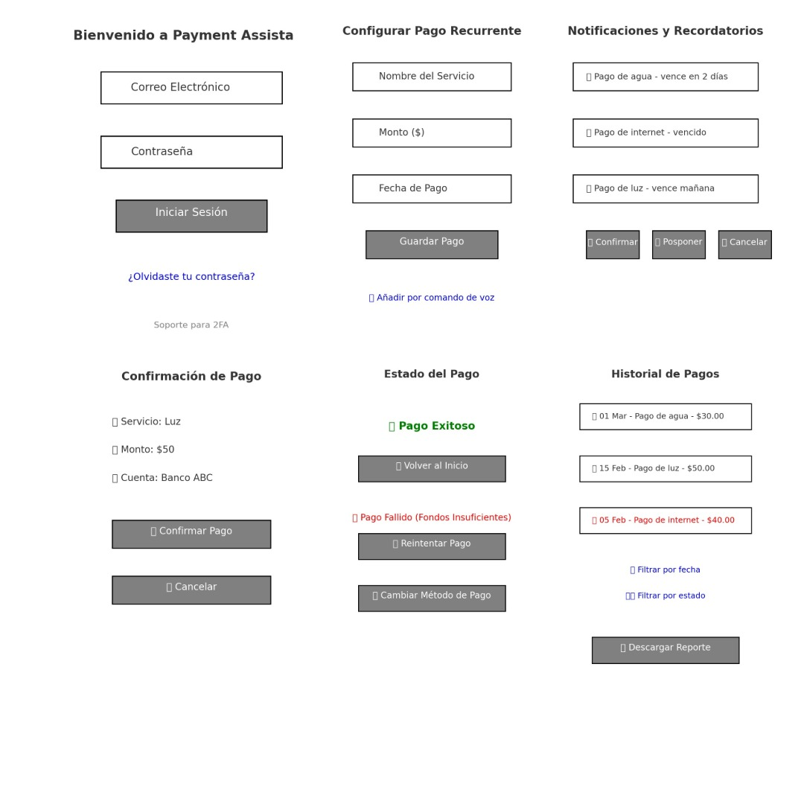

## 6. Cree las pantallas a modo mockup o mimic utilizando alguna AI que genere código en el lenguaje que haya seleccionado en el entregable #1. Si ninguna AI genera para ese lenguaje, entonces proceda a utilizar plantillas para crear las pantallas diseñadas.

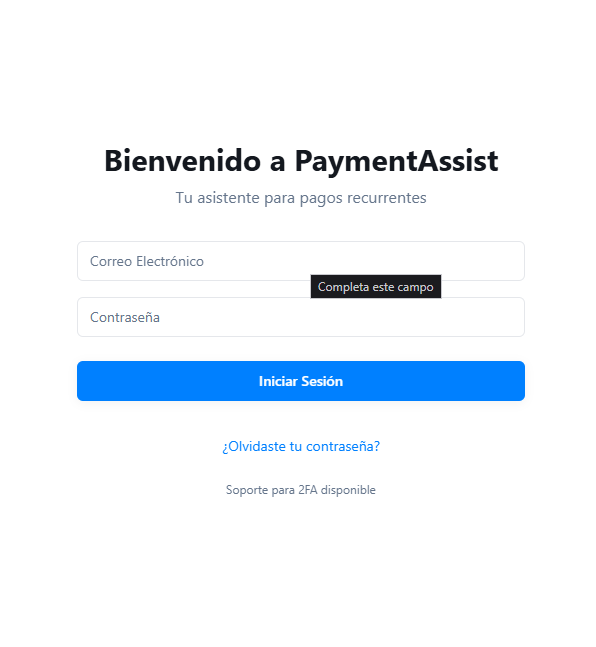

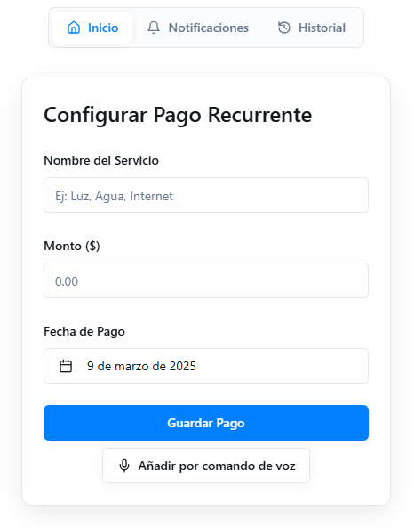

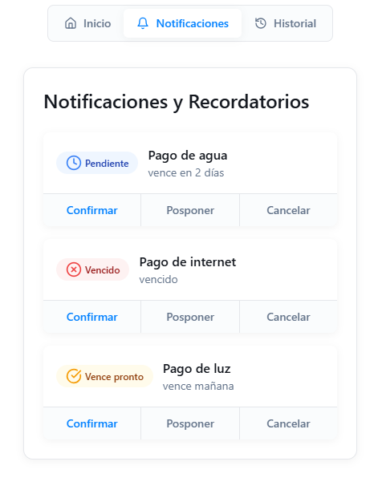

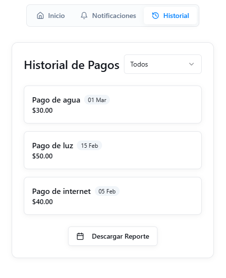

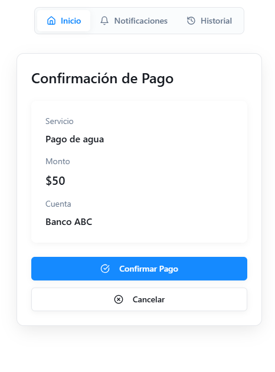

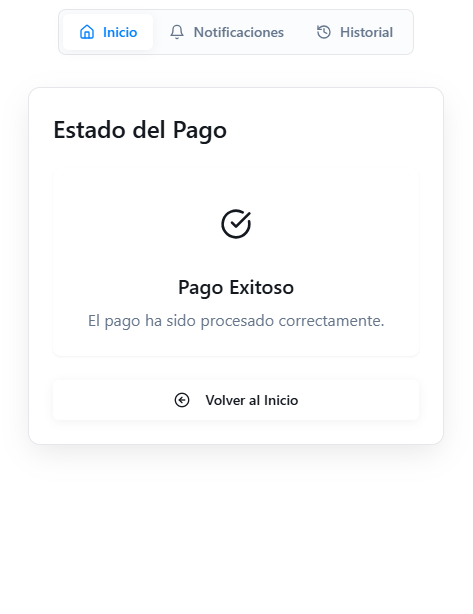

## 7. Proceda a realizar un test de usabilidad con al menos 3 personas (que no sean estudiantes del Tec), de las pantallas diseñadas utilizando alguna herramienta de testing de usuabilidad digital en la nube, recopile los resultados.

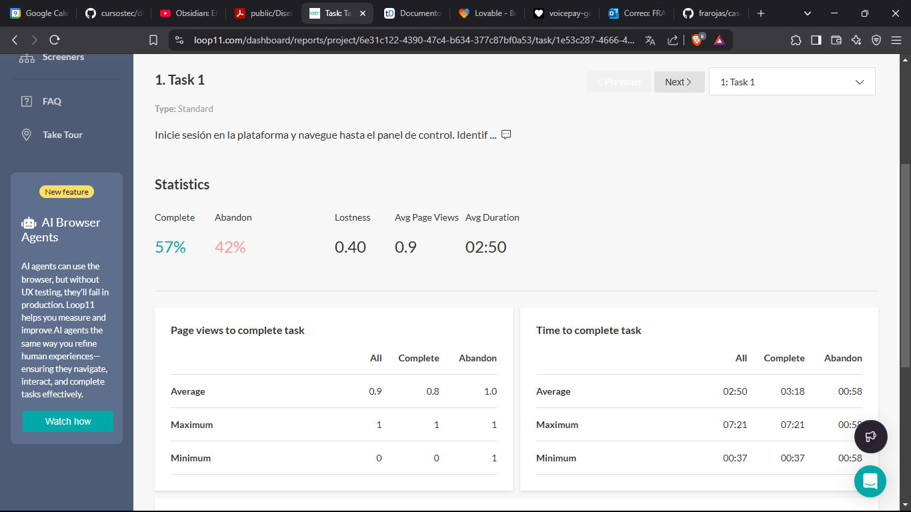

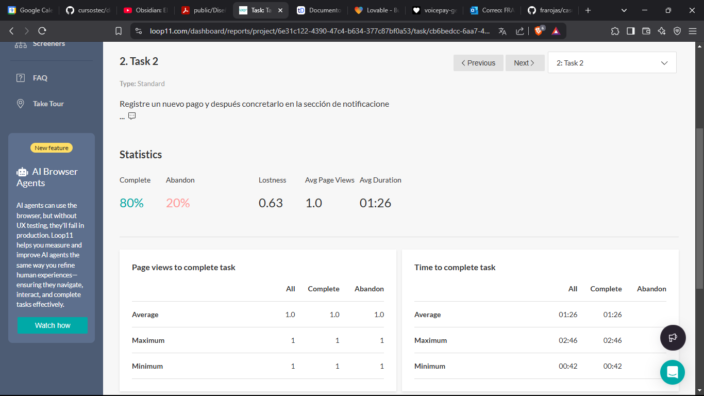

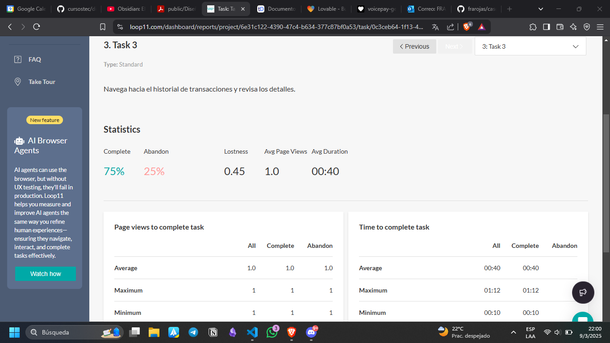

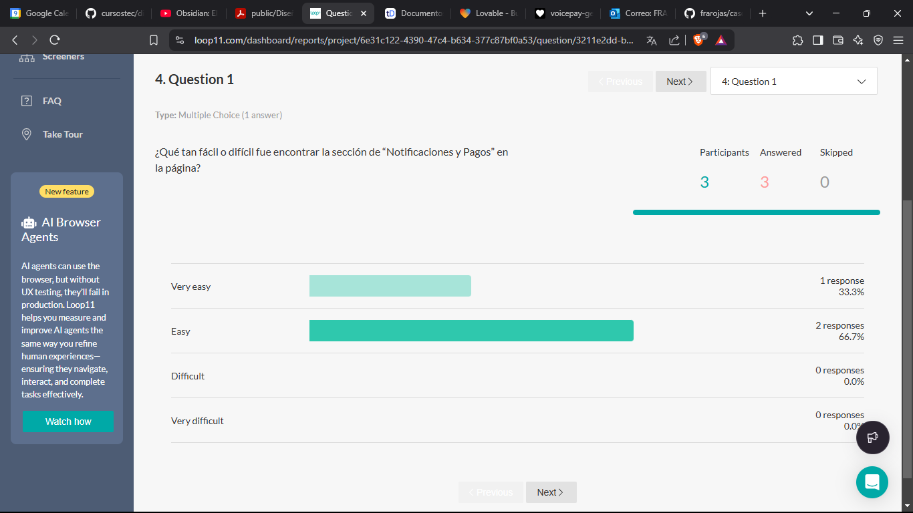

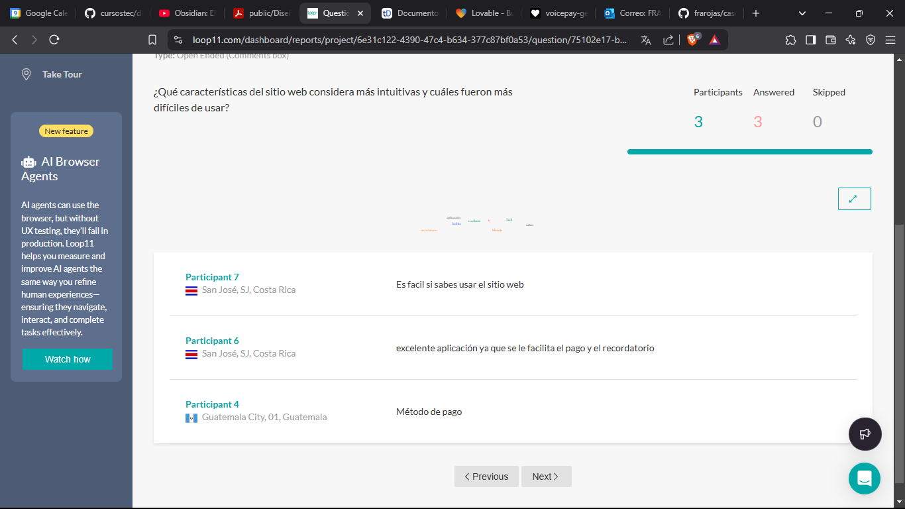

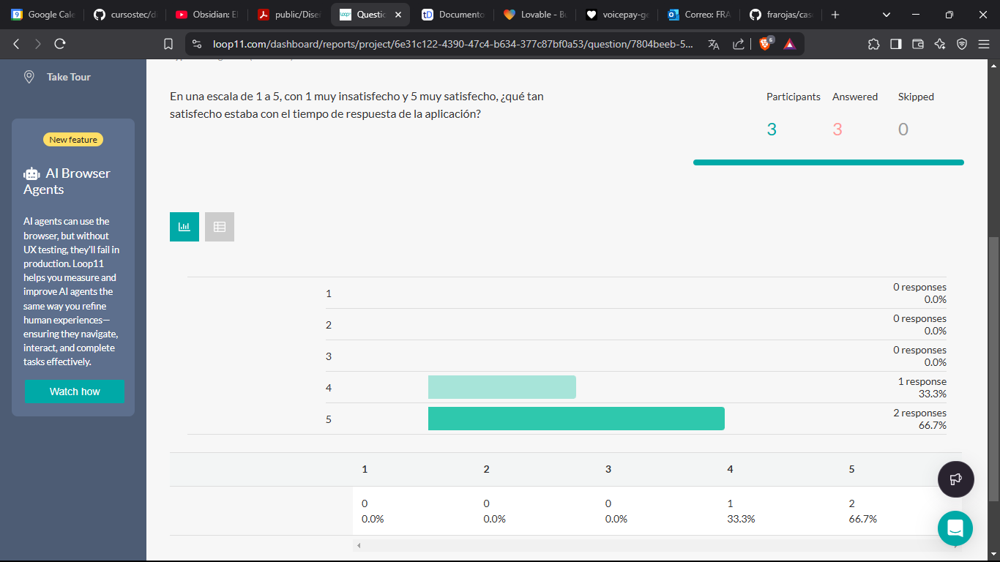

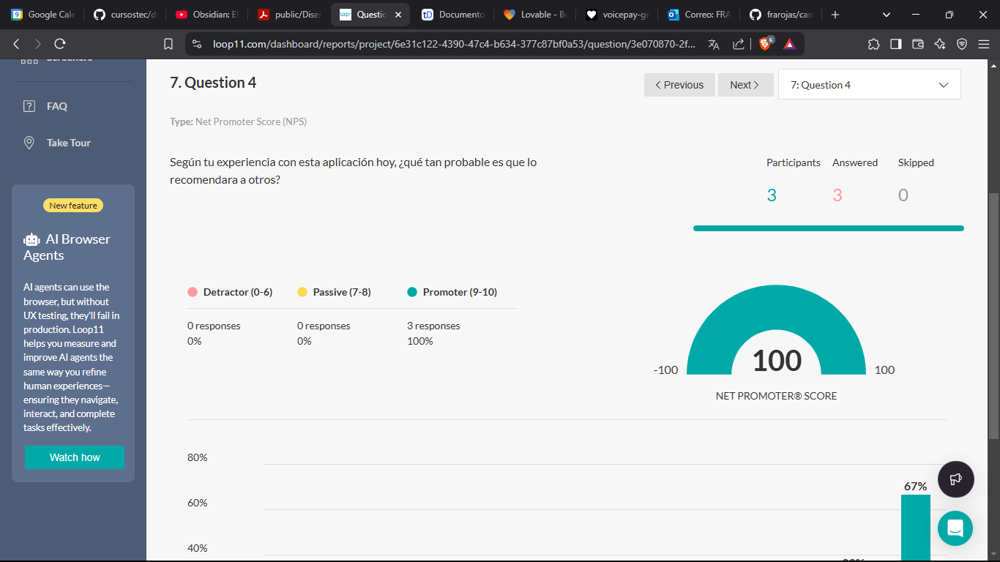

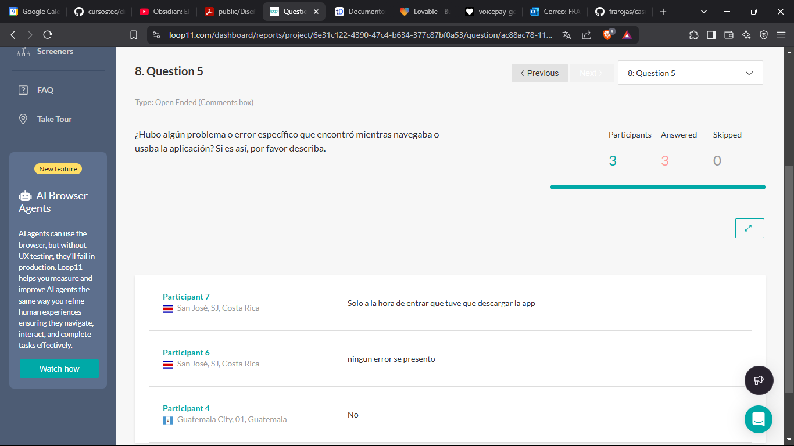

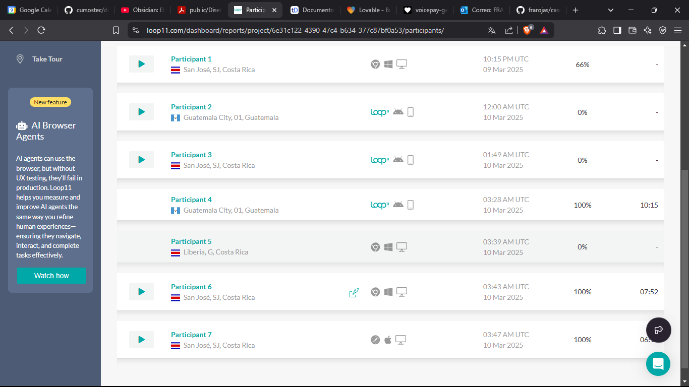